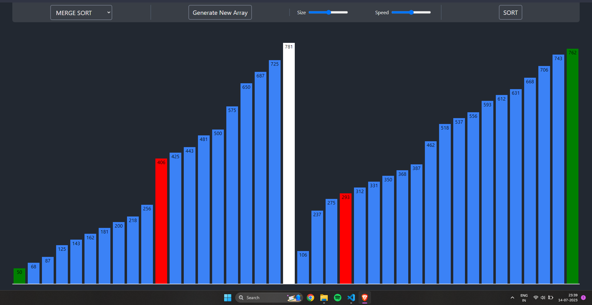

# Sorting-Algorithm-Visualizer

Easy to Understand Visualization Sorting Algorithms like mergeSort, insertion Sort ect.

## delpoyment
- #### [link](https://snazzy-praline-f2e84a.netlify.app/)

## Run Locally

Clone the project

```bash
  git clone https://github.com/rakshit0960/Sorting-Algorithm-Visualizer.git
```

Go to the project directory

```bash
  cd Sorting-Algorithm-Visualizer
```

Install dependencies

```bash
  yarn
```

Start the server

```bash
  yarn dev
```


## Tech Stack

**Client:** React, TailwindCSS


## Screenshots





